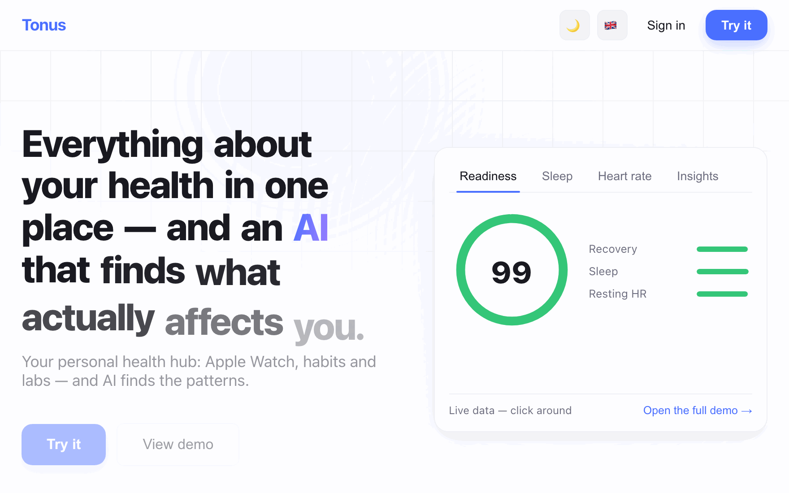
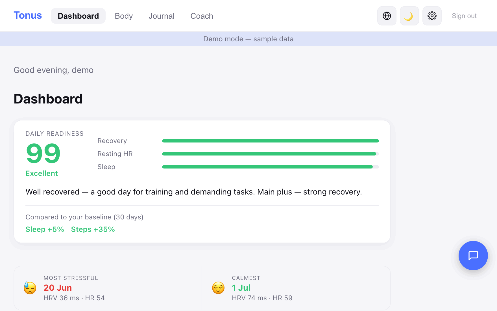
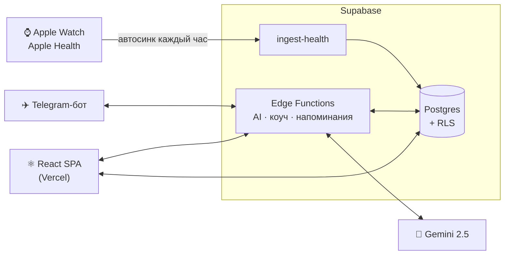

<div align="center">


<br/><br/>

[](https://github.com/batstolya/tonus/actions/workflows/ci.yml)


**Подключаешь Apple Watch, логируешь привычки и анализы — AI находит закономерности,<br/>которые реально влияют на твоё самочувствие.**

</div>

---

## ✨ Продукт за 30 секунд

Лендинг с живой демо-панелью — кликать можно прямо на первом экране:

<div align="center">

</div>

Кнопка **«Посмотреть демо»** открывает всё приложение на сгенерированных данных — без регистрации и бэкенда:

<div align="center">

</div>

## 🧩 Что умеет

| | | |
|---|---|---|
| ⌚ **Автосинк Apple Health** — часы сами шлют данные каждый час | 🧠 **AI-инсайты** — Gemini ищет связи: сон ↔ кофе ↔ стресс ↔ HRV | 💬 **Чат со своими данными** — отвечает по твоим метрикам, не по интернету |
| ✈️ **Telegram-бот** — логирование одной строкой: «кофе», «магний», «пробежка» | 📈 **Скоры готовности** — readiness / recovery / sleep / stress против личной 30-дневной нормы | 🔬 **Эксперименты** — меняешь привычку, Tonus честно меряет «до/после» |
| 🛡️ **Страж здоровья** — ранний сигнал болезни по RHR/температуре/HRV, за 24–48ч до симптомов | 🔗 **Связи в данных** — лаг-корреляции: «кофе сегодня → HRV завтра», честная статистика | 📱 **iPhone-виджет** — readiness на домашнем экране (Scriptable, `/widget` в боте) |
| 💊 Препараты, напоминания и % соблюдения | 🧪 Анализы (авторазбор PDF) | 🍔 Питание по фото |
| 🎯 Цели | 🩺 Жалобы и симптомы | 📤 Экспорт всех данных в один клик |

Интерфейс: 🇺🇦 украинский · 🇬🇧 английский. Темы: светлая и тёмная.

## ⚙️ Как устроено



- **Frontend:** React 19 + Vite 8 + TypeScript (strict) + Recharts + Motion
- **Backend:** Supabase — Postgres с RLS и 19 edge-функций на Deno
- **AI:** Gemini 2.5 Flash с бюджет-гардом на токены
- Формулы скоров зеркалированы клиент/сервер и защищены golden-тестами + тестом зеркальности

## 🚀 Быстрый старт

> ⚠️ Нужен **Node 24** (`nvm use 24`) — Vite 8 на Node 18 падает.

```bash
npm install

# dev-серверу хватает dummy-ключей (лендинг статичный):
cat > .env.local <<'EOF'
VITE_SUPABASE_URL=http://localhost:54321
VITE_SUPABASE_ANON_KEY=test-anon-key
EOF

npm run dev        # http://localhost:5173
```

Весь UI без бэкенда: кнопка **«Посмотреть демо»** на лендинге (или `VITE_DEMO=1` в `.env.local`) — 90 дней сгенерированных метрик.

```bash
npm test           # vitest: 154 теста (формулы, переводы, боты)
npm run test:e2e   # playwright: смоук лендинга и демо
npm run build      # tsc (strict) + vite build
```

## 🛡️ Качество

Прод обновляется **только через зелёный CI**: push в `main` → тесты + сборка + e2e + lint-потолок → deploy hook Vercel. Красный CI — прод не тронут.

- golden-тесты формул скоров с обеих сторон (клиент и edge-функция)
- переводы под тестами — русский не протекает в uk/en интерфейс
- e2e-смоук критического пути: лендинг → демо → дашборд

## 📁 Структура

- `src/` — фронтенд: компоненты по фичам, `lib/`, `hooks/`, `parsers/`, `store/`
- `supabase/` — миграции и 19 edge-функций (общий код — в `_shared/`)
- `scripts/` — вспомогательные скрипты (в т.ч. перезапись медиа для README)
- `claude-monitor/` — сервис мониторинга лимитов Claude (launchd/Docker)

## 📚 Документация

| Где | Что |
|---|---|
| [`docs/specs/`](docs/specs/) | продуктовые спеки (фазы 3–10, фичи) |
| [`docs/guides/`](docs/guides/) | гайды: экспорт календаря, монитор Claude |
| [`.claude/skills/`](.claude/skills/) | скиллы для AI-агентов: запуск, деплой, скоры, i18n, отладка прода |
| [`CLAUDE.md`](CLAUDE.md) | вводная для агентов и людей |

---

<div align="center">
<sub>Tonus © 2026 · сделано для одного пользователя, спроектировано как продукт</sub>
</div>
