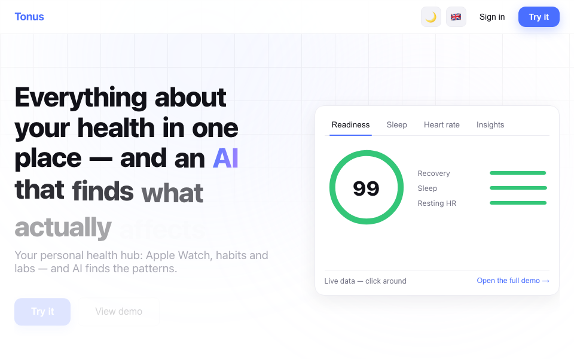
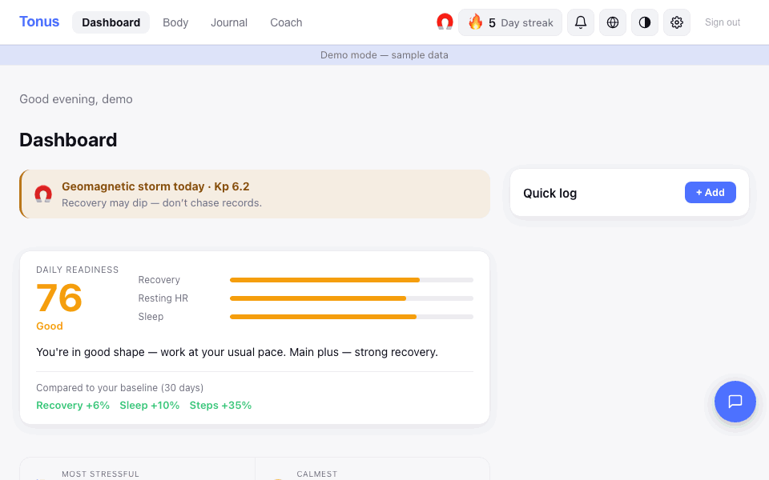
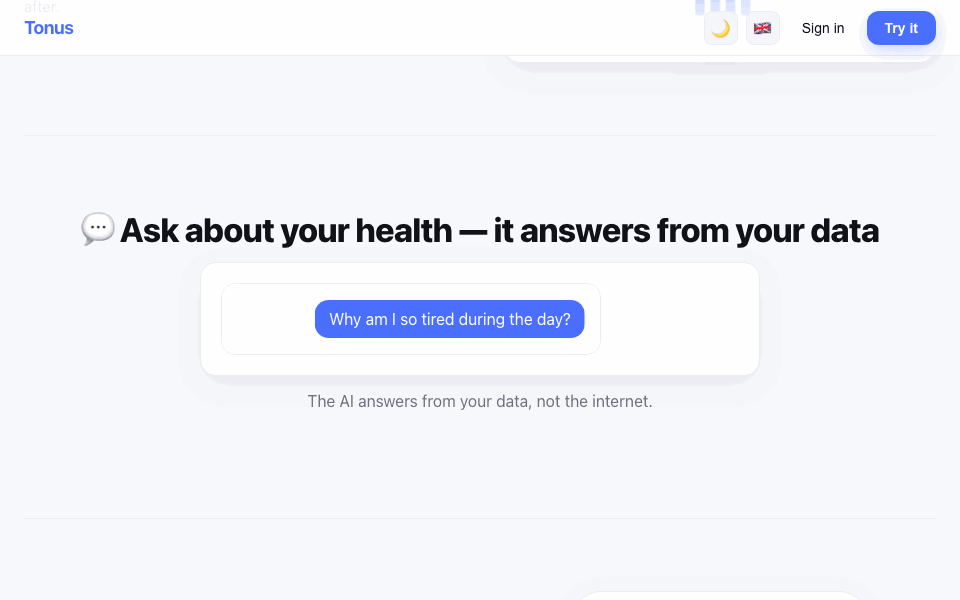
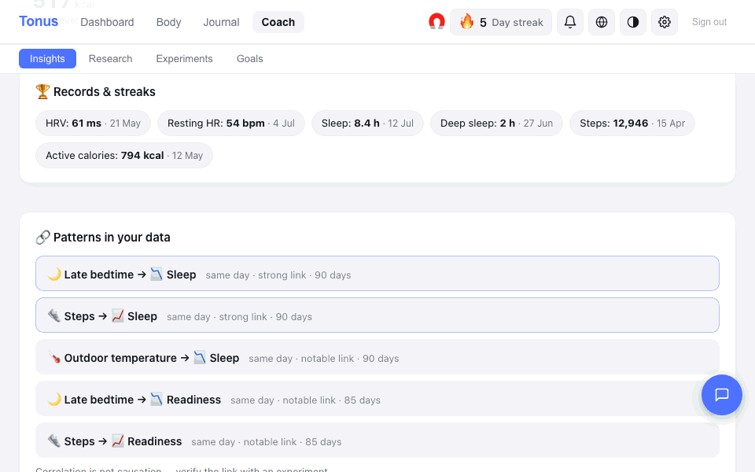
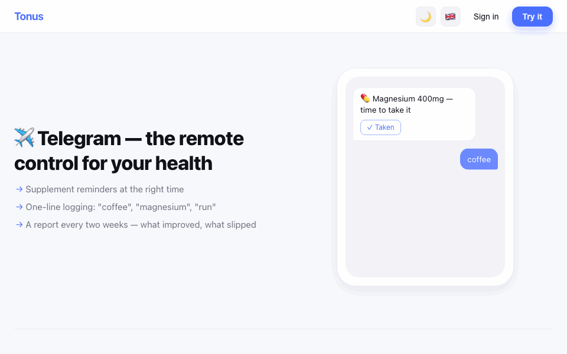
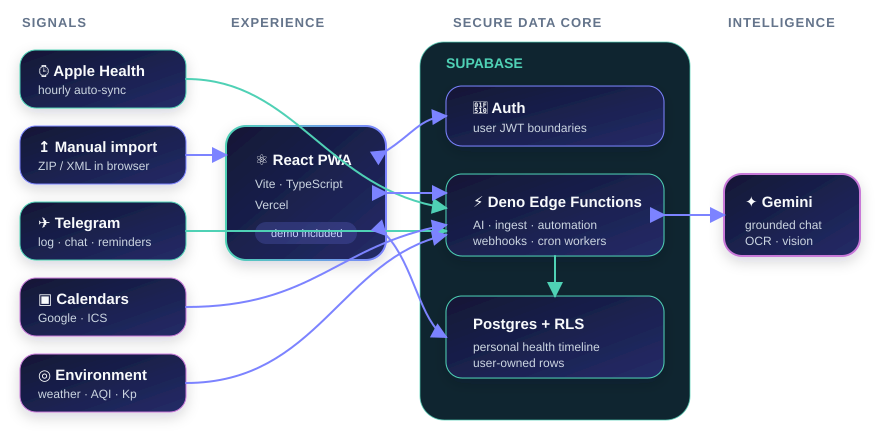

<div align="center">



<br/>

[English](README.md) · **Українська**

<br/>

[](https://github.com/batstolya/tonus/actions/workflows/ci.yml)


**Підключи Apple Watch, фіксуй звички й аналізи — а Tonus знайде закономірності,<br/>
які справді впливають на твоє самопочуття.**

</div>

---

## Подивіться Tonus у дії

На лендингу є жива панель показників, а повне 90-денне демо відкривається без
реєстрації та підключеного бекенду.

<div align="center">

</div>

<table>
  <tr>
    <td width="50%" valign="top">
      
      <br/><strong>Сигнал дня</strong><br/>
      Готовність, контекст відновлення, серії та попередження — одним поглядом.
    </td>
    <td width="50%" valign="top">
      
      <br/><strong>Запитай свої дані</strong><br/>
      Постав запитання звичайною мовою — відповідь спиратиметься на твою історію.
    </td>
  </tr>
  <tr>
    <td width="50%" valign="top">
      
      <br/><strong>Від закономірності до експерименту</strong><br/>
      Перевір спостережуваний зв’язок як вимірювану зміну n=1.
    </td>
    <td width="50%" valign="top">
      
      <br/><strong>Єдина хронологія здоров’я</strong><br/>
      Фіксуй каву, їжу, ліки й тренування, навіть не відкриваючи застосунок.
    </td>
  </tr>
</table>

## Що об’єднує Tonus

Tonus збирає розрізнені сигнали в одну особисту хронологію. Медичні метрики
надходять автоматично, щоденний контекст фіксується за секунди, а зовнішні
фактори прив’язуються до тих самих дат, що й твої результати.

| Джерело | Що потрапляє до Tonus |
|---|---|
| **Apple Health** | Щогодинна синхронізація через Health Auto Export: сон, HRV, пульс, активність, SpO₂, температура тощо |
| **Майстер підключення** | Покрокове налаштування Apple Watch і Xiaomi/Mi Fitness на iPhone з живою перевіркою першої синхронізації |
| **Ручний імпорт** | ZIP/XML Apple Health обробляється локально у Web Worker — сирий експорт не мусить залишати браузер |
| **Telegram** | Записи природною мовою, фото їжі, приймання ліків, запитання, нагадування та звіти |
| **Календарі** | Контекст Google Calendar та ICS для аналізу стресу й навантаження |
| **Довкілля** | Погода, якість повітря, пилок, світловий день, перепади тиску та геомагнітний індекс Kp |

## Що вміє Tonus

<table>
  <tr>
    <td width="50%" valign="top">
      <strong>Зрозуміти сьогоднішній стан</strong><br/><br/>
      Готовність відносно особистої 30-денної норми; екрани сну, HRV, серця й активності; серії активних днів; план тренувань і дотримання; центр сповіщень; ранні попередження про стан здоров’я та геомагнітні бурі.
    </td>
    <td width="50%" valign="top">
      <strong>Знайти закономірності</strong><br/><br/>
      Лаг-кореляції, фактори довкілля, тренди, рекорди й аномалії; ШІ-чат із серверними інструментами даних; аналіз періоду; готовий до друку звіт і список запитань для лікаря.
    </td>
  </tr>
  <tr>
    <td width="50%" valign="top">
      <strong>Змінювати поведінку</strong><br/><br/>
      Експерименти n=1 з розміром ефекту, пропозиції від ШІ, автоматичні висновки, вимірювані цілі, модель виведення кофеїну, відстеження лікування, дотримання приймання ліків і нагадування.
    </td>
    <td width="50%" valign="top">
      <strong>Зберігати повну картину</strong><br/><br/>
      OCR аналізів із PDF/фото, оцінка харчування за фото, добавки, нотатки дня, симптоми й приватні проблеми за PIN-кодом, відстеження волосся, календарний контекст і повний експорт JSON/CSV.
    </td>
  </tr>
</table>

Інтерфейс доступний 🇺🇦 українською та 🇬🇧 англійською, у світлій і темній темах.

## Як це працює

<div align="center">

</div>

- **Фронтенд:** React 19, Vite 8 і strict TypeScript; PWA розгортається на Vercel.
- **Бекенд:** Supabase Postgres із RLS та понад 20 Edge Functions на Deno.
- **ШІ:** Gemini 2.5 Flash для чату на основі даних, пояснень, OCR і комп’ютерного зору.
- **Автоматизація:** `pg_cron` запускає нагадування, звіти, синхронізацію довкілля та сценарії коуча.
- **Статистика:** особисті базові лінії, лаг-кореляції Пірсона та ефекти експериментів Cohen's d обчислюються до того, як ШІ пояснить результат.

Браузер відповідає за інтерфейс і локальний імпорт. Supabase керує ідентифікацією,
даними, політиками та серверними процесами. Gemini отримує спеціально сформований
контекст здоров’я, а не необмежений доступ до бази.

## Приватність і безпека

- Рядки користувача захищені Row Level Security у Postgres (`auth.uid() = user_id`).
- Ключі Gemini та привілейовані ключі бази залишаються всередині серверних функцій.
- Вебхуки, cron-процеси й адміністративні дії мають окремі секрети та межі доступу.
- Чутливі проблеми можна приховати локальним PIN-кодом.
- Усі особисті дані можна експортувати у JSON і CSV.
- Tonus показує спостереження та невизначеність; це не медичний пристрій і він не встановлює діагнози.

## Інженерна частина

- Strict TypeScript у React-клієнті та спільній серверній логіці.
- Формули скорів дзеркально реалізовані на клієнті й сервері та захищені golden- і parity-тестами.
- Детерміновані demo-фікстури створюють видимі кореляції без доступу до production-даних.
- ШІ-чат використовує обмежений server-side function calling замість здогадок про відсутні факти.
- Доставка нагадувань має стани claim/complete/fail, повторні спроби й коректні локальні дати.
- Екрани функцій завантажуються ліниво, тому лендинг та авторизація не тягнуть важкі графіки.
- Production оновлюється лише після успішних тестів, збірки, e2e smoke-перевірок і lint-ліміту в CI.

## Локальний запуск

> Потрібен **Node 24**. Vite 8 не працює зі старим Node 18 за замовчуванням.

```bash
nvm use 24
npm install

cat > .env.local <<'EOF'
VITE_SUPABASE_URL=http://localhost:54321
VITE_SUPABASE_ANON_KEY=test-anon-key
EOF

npm run dev        # http://localhost:5173
```

Лендинг статичний, а кнопка **View demo** відкриває повний інтерфейс зі
згенерованими даними. Також можна встановити `VITE_DEMO=1`; для демонстрації
локальний Supabase не потрібен.

```bash
npm test           # Vitest: клієнтська логіка + спільна логіка Edge Functions
npm run test:e2e   # Playwright: smoke-тести лендингу, демо й майстра підключення
npm run build      # strict TypeScript + production-збірка Vite
```

Щоб оновити медіа README після змін інтерфейсу:

```bash
npm run build
npm run preview -- --port 4173 --strictPort
# у другому терміналі
npm run media:readme
```

## Структура репозиторію

- [`src/`](src/) — React-екрани за функціями, хуки, парсери, стан і клієнтська статистика.
- [`supabase/`](supabase/) — базові міграції, RLS-політики, Deno Edge Functions і спільна серверна логіка.
- [`scripts/`](scripts/) — операційний SQL, допоміжні інструменти даних і відтворювана збірка медіа README.
- [`e2e/`](e2e/) — критичні користувацькі сценарії Playwright.
- [`claude-monitor/`](claude-monitor/) — необов’язковий локальний монітор використання Claude.

## Документація

| Розташування | Вміст |
|---|---|
| [`docs/specs/`](docs/specs/) | Специфікації продукту та функцій |
| [`docs/guides/`](docs/guides/) | Інструкції з експлуатації, експорту календаря, нагадувань і безпеки |
| [`.claude/skills/`](.claude/skills/) | Робочі процеси репозиторію для AI coding agents |
| [`CLAUDE.md`](CLAUDE.md) | Огляд кодової бази та правила роботи |

## Особисті розширення

Футбольні нагадування та локальний монітор лімітів Claude — це особисті
автоматизації на тій самій інфраструктурі сповіщень, а не основні health-функції
Tonus.

---

<div align="center">
<sub>Tonus © 2026 · створено для однієї людини, спроєктовано як продукт</sub>
</div>
